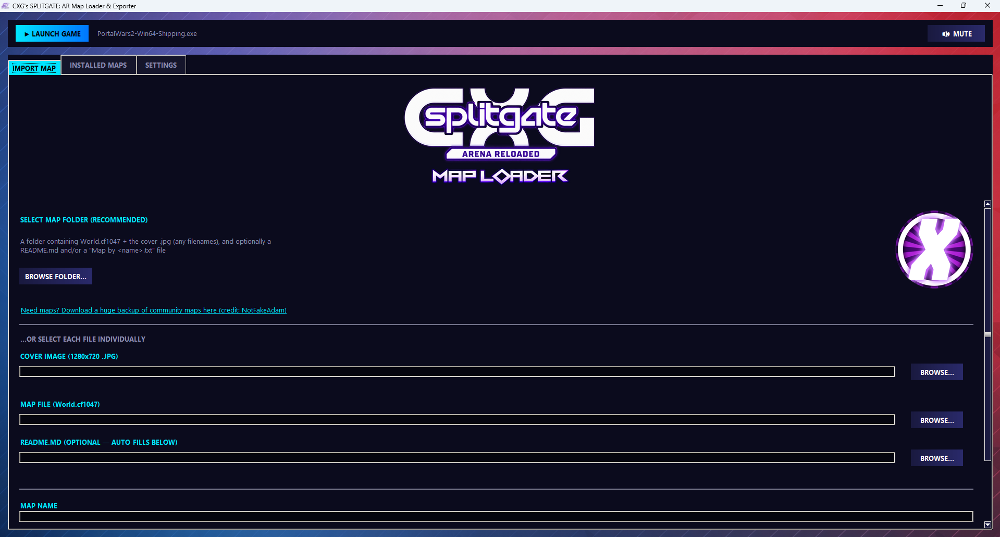
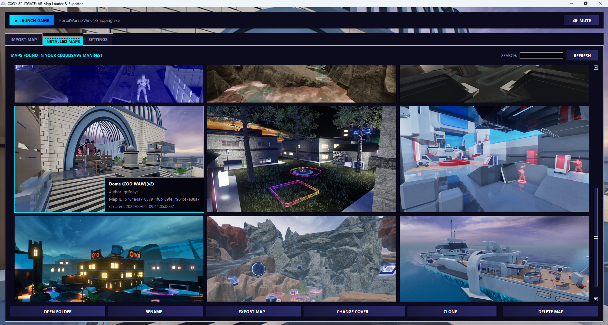
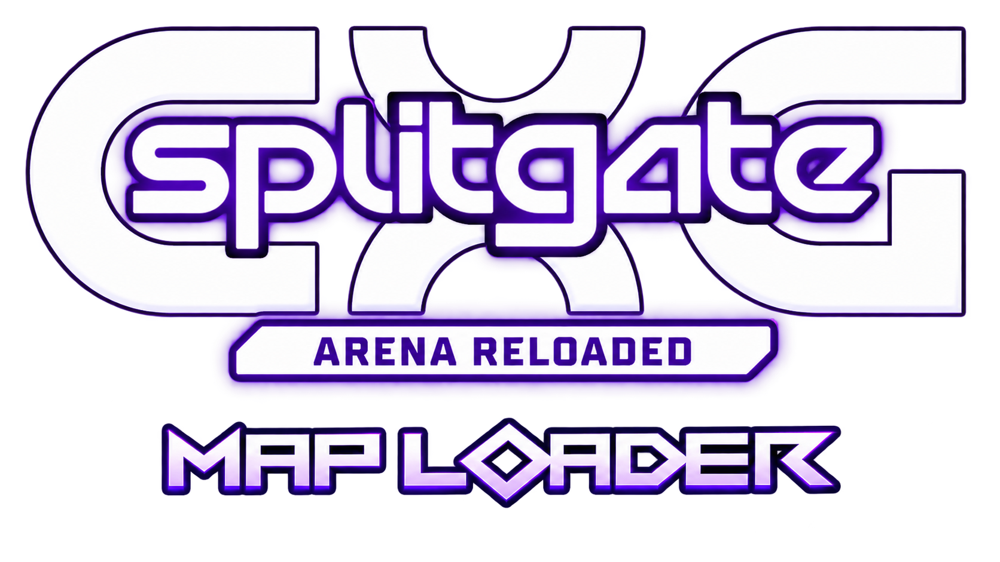

# How to Use my Splitgate Map Loader

## First time opening it
If you've never made or imported a map before, the **IMPORT MAP** button will be locked. Just go create one map in Splitgate: Arena Reloaded first, then come back and it'll unlock on its own.

## Importing a map
1. Go to the **IMPORT MAP** tab.
2. Click **BROWSE FOLDER...** and pick the folder with your map in it (or just drag the folder onto the window).
3. If it found everything, the boxes below will already be filled in. If not, fill in the Map Name and Author yourself.
4. Click **IMPORT MAP**.
5. Restart Splitgate (or reopen the map browser) to see it in-game.

**Tip:** You can also drag in more than one map folder at once and it'll import all of them right away, no button needed.

## Viewing your maps
Go to the **INSTALLED MAPS** tab. All your imported maps show up as thumbnails. Type in the search box to filter by name or author.

## Renaming a map
1. Click on the map to select it.
2. Click **RENAME...**
3. Change the name and/or author, then click **SAVE**.

## Cloning a map
Cloning makes a full copy of a map with its own separate ID — editing or deleting the copy never touches the original.
1. Click on the map to select it.
2. Click **CLONE...**
3. Type a name for the copy and click **CLONE**.

## Exporting a map
Exporting pulls a map's files back out into a normal folder, so you can share it or back it up.
1. Click on the map to select it.
2. Click **EXPORT MAP...**
3. Choose where to save it.

## Changing a map's cover image
1. Click on the map to select it.
2. Click **CHANGE COVER...**
3. Pick your new .jpg.

## Deleting a map
1. Click on the map to select it.
2. Click **DELETE MAP**.
3. Confirm.

## Launching the game
Click the **▶ LAUNCH GAME** button at the top of the window. If it can't find your game, go to the **SETTINGS** tab and click **AUTO-DETECT**, or browse for the .exe yourself.

## Changing your CloudSave folder or game location
Go to the **SETTINGS** tab. There you can update where your maps get saved and where your game's .exe is.

## Muting sound
Click the **MUTE** button next to Launch Game, top right.

That's pretty much it! Enjoy playing the thousands of community maps again!
**Youtube Channel** - https://www.youtube.com/@CallOfXGamer

