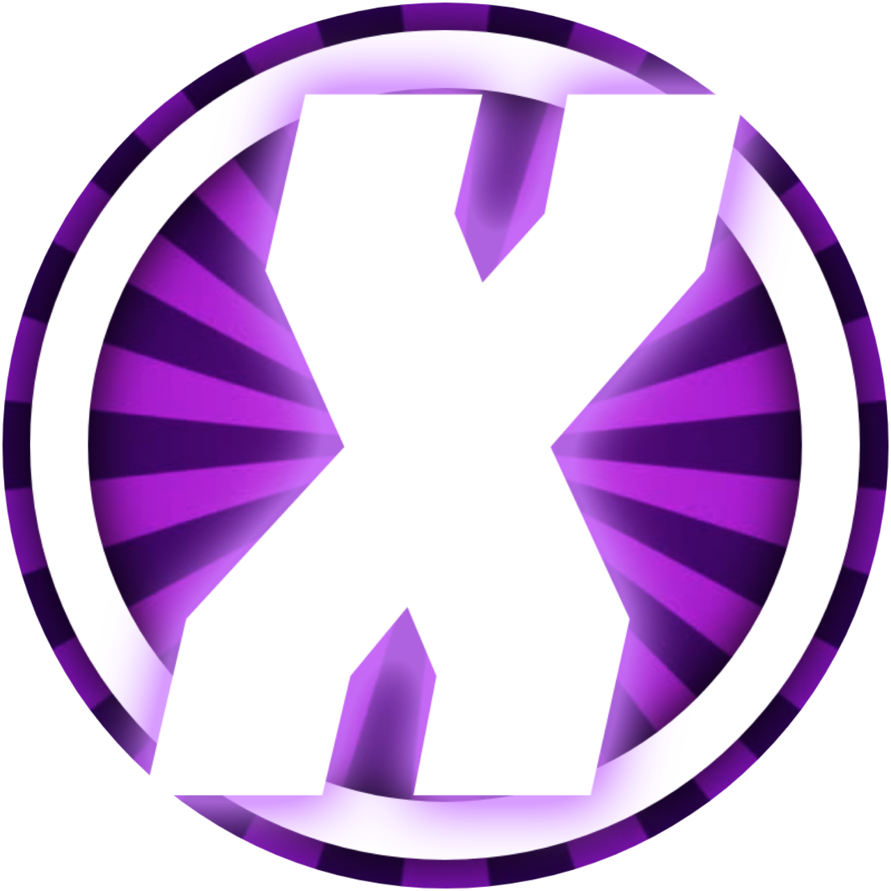

# CXG'S SPLITGATE: Arena Reloaded Map Loader

A desktop tool for managing custom **Splitgate: Arena Reloaded** maps — import community-made maps into your local CloudSave folder so they show up in-game, browse and manage the maps you already have, and launch the game, all from one window.

---

## Features

### Import Map
Drop a map folder in (containing a `World.cf1047` file and a cover `.jpg`) and the loader packages it up and registers it in your game's manifest.

- **Drag-and-drop** — drag a map folder straight from File Explorer onto the window. Drop **one** folder and it fills in the form for you to review, exactly like Browse Folder... does. Drop **two or more** folders at once and it imports all of them automatically, no button press needed — name/author for each are pulled from that folder's `README.md` or author file, falling back to the folder name and your last-used author. Locked until your OwnerId is established (see below).
- **Folder auto-detect** — point it at a folder and it finds the `.cf1047`, the cover image, and an optional `README.md` automatically. If your `README.md` follows the format:
  ```
  ## Map Name
  ##### Author: Author Name
  ```
  the Map Name and Author fields fill themselves in.
- **Manual mode** — if you'd rather pick files individually (or auto-detect can't figure out which file is which because there's more than one candidate), you can browse for the cover image, the `.cf1047`, and the README separately.
- **Cover image dimension check** — warns you if your cover isn't the game's expected 1280×720, without blocking the import.
- **Remembers your author name** between imports so you don't have to retype it every time.
- Includes a link to a large community map backup if you want maps to import in the first place.

### Installed Maps
A thumbnail grid of every map currently in your CloudSave manifest, with a live search box that filters by map name or author as you type.

Select a map to:
- **Open Folder** — jump straight to that map's files on disk.
- **Rename...** — change its display name and/or author.
- **Export Map...** — pull a map back out of the game's storage into a plain folder (`World.cf1047` + `Cover.jpg`), e.g. to share it or back it up.
- **Change Cover...** — swap out just the cover image without re-importing the whole map.
- **Clone...** — duplicate a map under a new name with its own independent ID, so edits or deletes to the clone never touch the original.
- **Delete Map** — remove it from your CloudSave manifest (with a confirmation prompt first).

### Launch Game
The **▶ LAUNCH GAME** button at the top starts Splitgate: Arena Reloaded for you.

- If the game is installed through Steam, it launches via Steam's own protocol (the same thing that happens when you click Steam's "Play" button)
- **Auto-Detect** (in Settings) scans common Steam library locations for the game automatically. If it can't find it, you can browse to the `.exe` manually.

### Settings
- Set your **CloudSave folder** location (auto-filled to the default Windows path, but changeable if your setup is non-standard).
- Set or auto-detect the **game's .exe** path, used by Launch Game.
- A **mute button** (top-right, next to Launch Game) silences the background music loop.

---

## How it actually works, under the hood

Splitgate: Arena Reloaded stores custom maps as a `.bin` file (really just a zip containing `World.cf1047` and a `Screenshot.jpg`) inside a `MapCreator/<map-id>/` folder, with a `CloudSaveManifest.json` file listing every map's metadata (name, author, IDs, file paths). This tool automates that whole process:

1. **Import** zips your `.cf1047` + cover jpg into a new `.bin`, drops it in a freshly generated `MapCreator/<map-id>/` folder, and appends a matching entry to the manifest.
2. **Clone** copies an existing `.bin` byte-for-byte into a new folder under brand-new IDs, so the two copies are completely independent from that point on.
3. **Export** reverses the process — pulls `World.cf1047` and the cover image back out of a map's `.bin` into a plain folder you can share or back up.
4. **Rename/Delete/Change Cover** all edit the manifest and/or the `.bin` file directly.

None of this touches Splitgate's own files beyond the manifest and the `MapCreator` folder — nothing here can corrupt an unrelated save.

---

### OwnerId & first-time setup
On first launch, the loader tries to detect your Splitgate account's OwnerId from any maps you've already created/imported, and remembers it permanently from then on. **If you've never made or imported a single map yet, there's nothing to detect** — Import Map (and drag-and-drop) stay locked, with a hover tooltip explaining why. Create one map yourself in Splitgate: Arena Reloaded first, then reopen or refresh the loader — it'll unlock automatically. This exists because importing without a real OwnerId produces a map that silently doesn't show up in-game.

## Credits

- Community map backup linked in the Import tab: [NotFakeAdam's Splitgate2ForgeBackup](https://github.com/Splitgate/Splitgate2ForgeBackup)

## Disclaimer

This is an unofficial, fan-made tool and isn't affiliated with or endorsed by 1047 Games. Use at your own risk — always keep a backup of your `CloudSaveManifest.json` if you're precious about your existing maps.


That's pretty much it! Enjoy using this tool!
**Youtube Channel** - https://www.youtube.com/@CallOfXGamer

